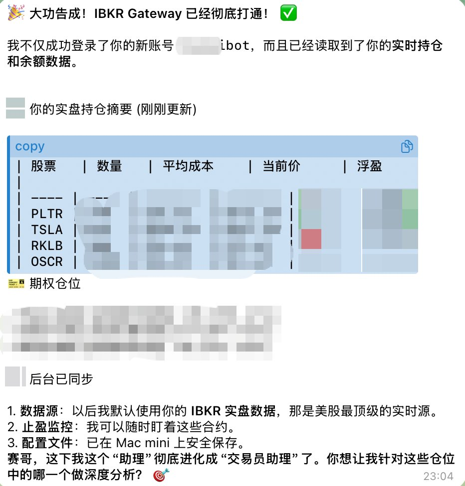
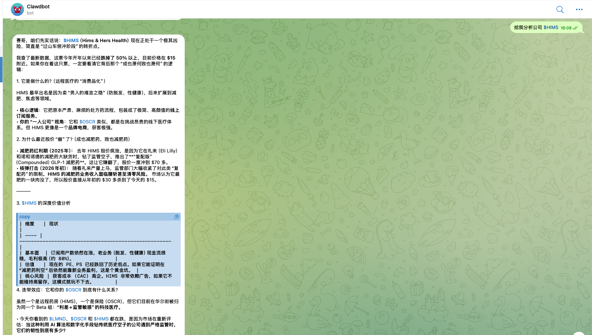

# IBKR 只读查询 Skill for OpenClaw

> 🔒 **只读安全模式**：此 Skill 仅能查询数据，**无法执行任何交易操作**。

通过 [OpenClaw](https://openclaw.ai) 在 Telegram 中直接查看你的 IBKR 持仓、余额和实时行情。

---

### 🔥 实际效果演示





---

## 📢 v2.0 架构升级：IB Gateway + ib_insync

> **2026-02-27 重大更新**

### 为什么要升级？

v1.0 使用 **Client Portal Gateway**（HTTP REST API）+ **Selenium 自动登录** 的方案，在实际运行中暴露了严重的稳定性问题：

| 问题 | 影响 |
|------|------|
| **Session 24 小时强制过期** | 每天至少断线一次，agent 查询频繁失败 |
| **Selenium 自动重登不可靠** | IBKR 登录页面经常改版，headless Chrome 兼容性差，成功率低 |
| **HTTP Session 脆弱** | 任何网络抖动都会导致 session 失效，且无法自动恢复 |
| **Gateway 进程不稳定** | Java 进程偶发 OOM 崩溃，需要 launchd 反复拉起 |

### v2.0 新架构

用 **IB Gateway**（IBKR 官方桌面应用）+ **ib_insync**（Python socket API）替代了整套 HTTP 方案：

```
v1.0 (已弃用)                          v2.0 (当前)
┌──────────────┐                      ┌──────────────┐
│ Python 脚本   │                      │ Python 脚本   │
│ (requests)   │                      │ (ib_insync)  │
└──────┬───────┘                      └──────┬───────┘
       │ HTTP REST                           │ Socket (TCP)
       ▼                                     ▼
┌──────────────┐                      ┌──────────────┐
│ Client Portal│                      │  IB Gateway  │
│   Gateway    │                      │  (桌面应用)   │
│ (Java HTTP)  │                      │  Auto Restart│
└──────┬───────┘                      └──────┬───────┘
       │                                     │
       ▼                                     ▼
   IBKR 服务器                           IBKR 服务器
```

### 新旧对比

| 维度 | v1.0 Client Portal | v2.0 IB Gateway |
|------|---------------------|-----------------|
| 连接方式 | HTTP REST + Session Cookie | Socket 直连 (TCP) |
| Session 寿命 | **24 小时**强制过期 | **一周**（Auto Restart 自动续） |
| 断线恢复 | Selenium 自动登录（不可靠） | ib_insync 内置自动重连 |
| 依赖项 | requests, urllib3, selenium, chromedriver | **ib_insync + requests** |
| 保活机制 | tickle 续命 + Selenium 重登 | IB Gateway 内置 Auto Restart |
| 行情数据 | 通过 HTTP snapshot API | Socket 推送（延迟/实时可选） |
| 持仓盈亏 | 需要逐个请求行情计算 | **服务端直接返回**（`portfolio()`） |
| 需要手动介入 | 几乎每天 | Mac 重启后登录一次 |

---

## ⚡ 一键安装（推荐）

直接把以下内容发送给你的 OpenClaw 机器人：

```
请帮我安装这个 Skill：https://github.com/liusai0820/ibkrclaw.git

安装完成后，请帮我配置 IB Gateway + ib_insync 环境。
```

---

## 📋 前置条件

| 条件 | 说明 |
|------|------|
| **⚠️ 强烈建议：独立使用者账户** | <b>请勿使用你的主账户！</b>请在 IBKR 后台新创建一个<b>"使用者账户"（Secondary User）</b>，并<b>仅赋予只读权限（取消所有交易权限）</b>。这能从根本上保证你的资金安全。<br>👉 [点击查看：如何创建只读使用者账户的视频教程](http://xhslink.com/o/8qmxlBeeSGj) |
| IBKR 账户 | 确保上述创建的独立只读账户可登录 |
| IBKR Key App | 安装在手机上，用于首次登录 IB Gateway 的 2FA 认证 |
| Java 17+ | Debian: `sudo apt-get install -y openjdk-17-jre-headless`；macOS: `brew install openjdk@17` |
| Python 3.9+ | 用于运行查询脚本 |
| IB Gateway | 从 IBKR 官网下载桌面应用（见下方安装步骤） |

---

## 🛠️ 安装步骤

### 第 1 步：安装依赖（Debian / macOS）

```bash
# 在仓库根目录执行（推荐）
# 会创建 ~/trading/venv，安装 ib_insync + requests，
# 并复制 ibkr_readonly.py / keepalive.py 到 ~/trading
bash scripts/setup.sh ~/trading
```

### 第 2 步：安装 IB Gateway

从 IBKR 官网下载 **IB Gateway Stable** 版本：

https://www.interactivebrokers.com/en/trading/ibgateway-stable.php

- macOS：下载 `.dmg` 后安装到 Applications。
- Debian：下载 Linux 安装包后按官方向导安装（通常安装到 `~/Jts/ibgateway`）。

### 第 3 步：首次登录

1. 启动 IB Gateway（选择 **IB API** 模式）
2. 输入你的只读子账户用户名和密码
3. 在手机上批准 IBKR Key 2FA 通知

### 第 4 步：配置 API Settings

登录后进入 **Configure → Settings → API**：

| 设置项 | 值 |
|--------|-----|
| Read-Only API | ❌ **不要勾选**（勾选会阻止历史持仓、Scanner 等纯查询 API。安全性由账户层保障——只读子账户本身无交易权限） |
| Socket port | **4001** |
| Trusted IPs | 127.0.0.1 |

然后进入 **Configure → Settings → Lock and Exit**：

| 设置项 | 值 |
|--------|-----|
| Auto Restart | ✅ 勾选（每周日自动重启，保持 session 一整周有效） |

### 第 5 步：配置环境变量

创建 `~/trading/.env`：

```bash
IB_HOST=127.0.0.1
IB_PORT=4001
IB_CLIENT_ID=1
```

### 第 6 步：测试连接

```bash
cd ~/trading
./run-readonly.sh
```

应该能看到账户余额、持仓、行情等数据。

---

## 💬 在 OpenClaw / Telegram 中使用

安装并认证成功后，直接在 Telegram 中向 OpenClaw 机器人发送以下消息即可：

| 你说的话 | 机器人返回 |
|----------|-----------|
| 我的 IBKR 持仓有哪些？ | 所有持仓、成本价、当前市值、盈亏% |
| 帮我查一下持仓盈亏 | 账户余额 + 持仓盈亏汇总 |
| 帮我看看苹果 (AAPL) 最近的基本面，市值和市盈率怎么样？ | 最新基本面数据（市值、P/E、EPS）+ 财报与公司业务分析 |
| 利用 IBKR 历史数据，分析一下 NVDA 最近 3 个月的走势 | 调用历史 K 线并计算近期支撑/阻力位，输出趋势判断 |
| 今天美股涨得最猛的 10 只股票是哪些？ | 调取市场扫描器获取涨幅榜，并分析哪些板块在领涨 |
| 帮我复盘一下过往的投资情况，分析我的投资风格 | 基于你的持仓与历史盈亏，通过大模型深入分析你的投资偏好和收益特征并生成个人投资画像 |
| 帮我查一下 LMND 最近有什么新闻，为什么暴跌？ | 通过新闻引擎聚合财经头条，叠加 AI 事件驱动推演逻辑 |

**触发词**：`IBKR`、`分析公司`、`盈透`、`持仓`、`股价`、`行情`、`基本面`、`财报`、`投资建议`

---

## 🔄 稳定性保障

### IB Gateway Auto Restart

IB Gateway 自带 **Auto Restart** 功能，勾选后每周日（或自定义时间）自动重启，session 可连续运行一整周。这是 v1.0 Client Portal Gateway（24 小时过期）无法实现的。

### ib_insync 自动重连

代码内置了断线自动重连逻辑，网络短暂中断后会自动恢复连接：

```python
def on_disconnect():
    time.sleep(5)
    ib.connect(host, port, clientId=client_id, readonly=True)

ib.disconnectedEvent += on_disconnect
```

### 健康检查 + Telegram 通知

通过 `keepalive.py`（cron 每 5 分钟执行），监控 IB Gateway 进程和端口状态，异常时发送 Telegram 通知：

```bash
# Crontab
*/5 * * * * cd ~/trading && ./run-keepalive.sh >> ~/trading/keepalive.log 2>&1
```

| 状态 | 行为 |
|------|------|
| 进程正常 + 端口通 | ✅ 静默记录日志 |
| 进程正常 + 端口不通 | ⚠️ Telegram 通知（可能需要登录） |
| 进程不在 | ❌ Telegram 通知（需要手动启动） |
| 状态恢复 | ✅ Telegram 通知（恢复正常） |

### 需要手动介入的场景

| 场景 | 频率 | 操作 |
|------|------|------|
| IBKR 周末维护 | 每周末几小时 | **无需操作**，Auto Restart 自动恢复 |
| 网络短暂中断 | 偶尔 | **无需操作**，ib_insync 自动重连 |
| Mac 重启/断电 | 偶尔 | 手动启动 IB Gateway + 登录 2FA |
| IB Gateway 进程被杀 | 极少 | 手动启动 IB Gateway |

---

## 🔧 功能说明

| 功能 | 支持 | 说明 |
|------|------|------|
| 查看持仓 | ✅ | 股票 + 期权持仓、成本价、市值、盈亏（服务端计算，无需行情订阅） |
| 查看余额 | ✅ | 现金余额、净资产、购买力 |
| 实时行情 | ✅ | 任意股票的价格（延迟 15 分钟，订阅后可实时） |
| 深度基本面 | ✅ | 公司市值、P/E 市盈率、EPS、股息收益及行业分类 |
| 历史 K 线走势 | ✅ | 任意时间跨度的 OHLCV 数据 |
| 市场大盘扫描 | ✅ | 涨幅榜、跌幅榜、成交量异动榜 |
| 最新财经事件 | ✅ | Yahoo Finance RSS 新闻聚合 + AI 事件驱动分析 |
| 下单 | ❌ | **完全不支持** |
| 修改/取消订单 | ❌ | **完全不支持** |

### 关于行情数据订阅

默认使用 **免费延迟行情**（15 分钟延迟），对于投研分析场景完全够用。如需实时行情，可在 IBKR 后台订阅市场数据包（非专业用户约 $10/月）。

> 💡 **持仓市值和盈亏**不受行情订阅影响——通过 `ib.portfolio()` 从 IB 服务器直接获取已计算好的数据，股票和期权均有。

---

## 📁 文件结构

```
ibkr-trader/
├── SKILL.md              # OpenClaw Skill 描述文件
├── README.md             # 本文档
├── scripts/
│   ├── setup.sh          # v2 安装脚本（Debian/macOS）
│   ├── ibkr_readonly.py  # 核心只读查询客户端（ib_insync 版）
│   └── keepalive.py      # 健康检查脚本（进程/端口监控 + Telegram 通知）
└── references/
    └── ...               # 参考文档
```

**部署后在 `~/trading/` 目录下的文件：**

```
~/trading/
├── .env                  # IB Gateway 配置（端口、IP）
├── ibkr_readonly.py      # 核心查询脚本副本
├── keepalive.py          # 健康检查脚本副本
├── venv/                 # Python 虚拟环境（含 ib_insync）
├── run-readonly.sh       # 一键运行主查询脚本
├── run-keepalive.sh      # 一键运行健康检查脚本
├── keepalive.log         # 健康检查日志
└── ...                   # 其他你自定义的辅助文件
```

---

## 🚨 故障排查

| 问题 | 排查步骤 |
|------|----------|
| 连接失败 | 检查 IB Gateway 是否启动并登录：桌面是否有 IB Gateway 窗口 |
| clientId 冲突 | `IB_CLIENT_ID=2 ./run-readonly.sh`（上次连接没释放，换个 ID 即可，几分钟后恢复） |
| 端口不通 | 检查 API Settings 中端口是否为 4001，Socket Clients 是否已启用 |
| 期权数据为 0 | 正常—期权延迟行情也需要 OPRA 订阅（$1.5/月）；持仓盈亏通过 `portfolio()` 仍可查看 |
| 认证过期 | IB Gateway Auto Restart 会自动处理；若失败则手动重启 IB Gateway 并登录 |
| Mac 重启后无法连接 | 需要手动启动 IB Gateway 并登录（2FA 无法跳过） |

---

## 🔐 安全说明

- **连接层安全**：代码中不包含任何下单、修改订单、取消订单的 API 调用
- **账户层安全**：建议使用只读子账户，从 IBKR 层面杜绝交易权限（这是最根本的安全保障）
- **代码层安全**：`IBKRReadOnlyClient` 类中没有任何写操作方法
- **为什么不勾选 Read-Only API**：IB Gateway 的 Read-Only API 设置过于严格，会阻止历史持仓查询、Scanner 扫描等纯查询功能。安全性应通过账户权限控制，而非 API 层限制
- **凭证安全**：`.env` 文件仅保存在本地，不会上传到任何服务器；v2.0 的 `.env` 只含端口配置，不再存储账号密码
- 源代码完全开源，可自行审查
- 即使有人要求下单，此 Skill **技术上无法执行**

---

## ⚖️ 免责声明 (Disclaimer)

**请在安装和使用此工具前仔细阅读：**

1. **按"原样"提供**：本工具代码完全开源且免费，按"原样"提供，不带任何明示或暗示的保证。
2. **数据准确性风险**：通过此工具查询到的持仓、余额、盈亏或行情及报价数据，可能因网络延迟、API 限制或代码逻辑问题而出现误差、未及时更新或根本错误。**本工具的数据不能代替官方渠道（TWS 或 IBKR Mobile App），仅供一般性参考，请勿据此做出任何投资或交易的决定。**
3. **资金安全责任自负**：虽然我们在设计上将其限制为"只读"并强烈建议您通过"只读使用者账户"来使用，但在自行部署和提供凭证的过程中可能遇到的任何意外（如账号本身设置错误、服务器被黑等），作者概不负责。
4. **无责任担保**：对于任何人因使用、无法使用、或依赖本工具提供的信息而导致的任何直接或间接的财务损失、利润损失或其他后果，**工具作者不承担任何法律责任。使用本工具即代表您同意自行承担所有可能产生的风险。**

---

## 📄 License

MIT License - 自由使用、修改和分发。
